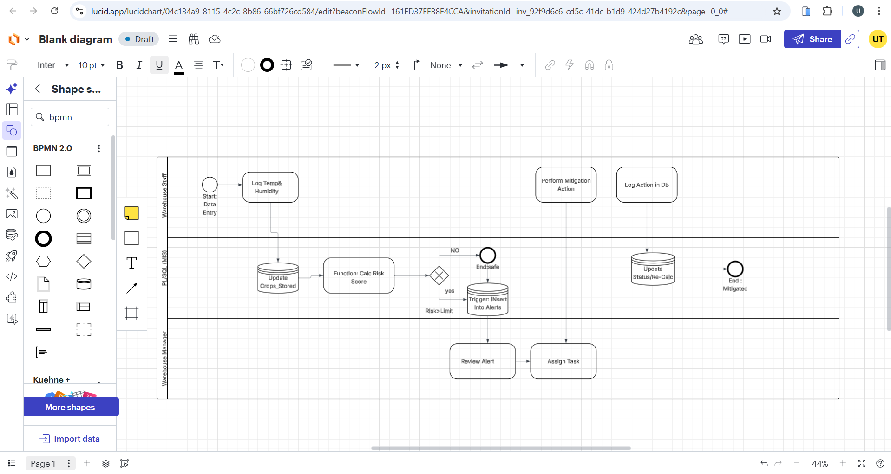
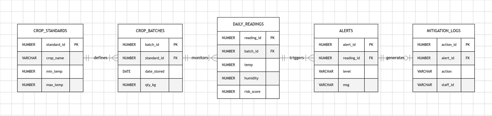
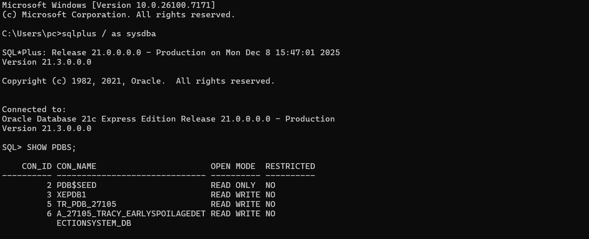
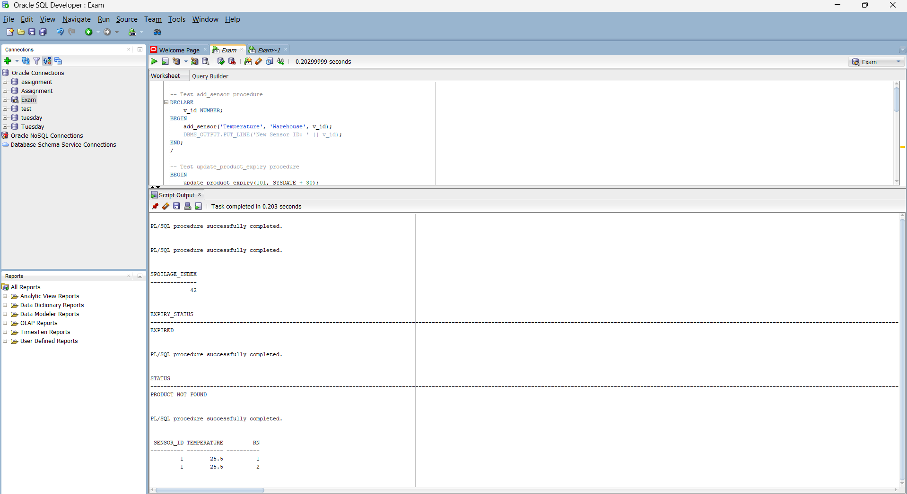
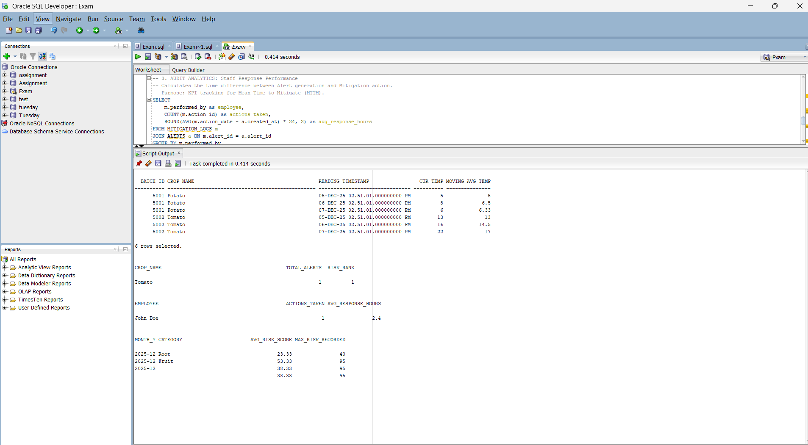

# Early Spoilage Detection System – PL/SQL Capstone Project

## Student: Uwase Tracy
## Student ID: 27105
## Date : 4th.12.2025
## Institution: Adventist University of Central Africa (AUCA)

## Project Overview

This project implements a PL/SQL-based Early Spoilage Detection System that manages sensors, monitors conditions, enforces business rules, and maintains a secure audit trail.
It includes triggers, procedures, functions, error handling, security rules, analytics, and BI documentation.

## Problem Statement

Warehouses experience losses due to unnoticed spoilage. A system is needed to record sensor activity, block invalid operations, detect policy violations, and maintain accurate auditing for operational oversight.

## Key Objectives

Build a complete relational database

Implement PL/SQL logic (procedures, functions, triggers, packages)

Enforce business rules (no weekday/holiday operations)

Record ALL activity in an audit log

Provide analytics queries

Provide Business Intelligence KPIs and dashboards

Deliver structured documentation

# PHASE II: Business Process Modeling

# PHASE III: Logical Model Design

# PHASE IV – Database Creation for Early Spoilage Detection System.

## Database Setup
- PDB: A_27105_Tracy_EarlySpoilageDetectionSystem_DB
- Admin User: tracy_admin
- Password: Tracy
- Memory: SGA_TARGET=200M, PGA_AGGREGATE_TARGET=100M
- Tablespaces: data_ts, index_ts, temp_ts
- Archive Logging: Enabled at CDB level

# EarlySpoilageDetectionSystem – PHASE V: Table Implementation & Data Insertion

## Overview
This phase implements the physical database structure for the EarlySpoilageDetectionSystem project. It includes:

- Creation of all tables with primary and foreign keys
- Constraints (NOT NULL, UNIQUE, CHECK, DEFAULT)
- Indexes for performance
- Sample data insertion (100+ rows for main tables)
- Validation queries to ensure data integrity and business rules compliance

---

## Pluggable Database Details
- **Database Name:** A_27105_Tracy_EarlySpoilageDetectionSystem_DB
- **Admin User:** tracy_admin
- **Password:** Tracy
- **Tablespaces Used:**
  - `data_ts` → tables
  - `index_ts` → indexes
  - `temp_ts` → temporary tables

---

## Tables Implemented

### sensor
- **Primary Key:** sensor_id  
- **Columns:** sensor_type, location, installation_date  
- **Constraints:** NOT NULL on sensor_type, default SYSDATE for installation_date  
- **Tablespace:** data_ts  

### product
- **Primary Key:** product_id  
- **Columns:** product_name, category, manufacture_date, expiry_date  
- **Constraints:** NOT NULL on product_name  
- **Indexes:** idx_product_category on category  
- **Tablespace:** data_ts  

### measurement
- **Primary Key:** measurement_id  
- **Foreign Key:** sensor_id → sensor(sensor_id)  
- **Columns:** measure_date, temperature, humidity, spoilage_index  
- **Constraints:** CHECK on temperature (-50 to 100) and humidity (0 to 100), default 0 for spoilage_index  
- **Indexes:** idx_measurement_sensor on sensor_id  
- **Tablespace:** data_ts  

---

## Sample Data
- **sensor table:** multiple types of sensors with locations  
- **product table:** realistic product names, categories, manufacture and expiry dates  
- **measurement table:** sensor readings including temperature, humidity, and spoilage index  

> All tables have at least 100 realistic rows to simulate actual use cases.

---

## Validation & Testing
- **Basic retrieval queries:** SELECT * FROM each table  
- **Joins:** measurement joined with sensor  
- **Aggregations:** AVG temperature and humidity per sensor  
- **Subqueries:** products expiring within 10 days  
- **Integrity checks:** foreign key relationships enforced, constraints tested  

# PHASE VI – Database Interaction & Transactions

## Objective
Develop PL/SQL procedures, functions, cursors, window functions, and packages to interact with the database, enforce business rules, and perform data operations.

---

## Overview

This phase focuses on:

- **Procedures** – automate insert, update, and delete operations.
- **Functions** – calculate values, validate data, and retrieve information.
- **Packages** – group related procedures and functions for modularity.
- **Cursors** – process multiple rows efficiently.
- **Window Functions** – analyze trends and ranking within datasets.
- **Testing** – verify outputs, edge cases, and performance.

---

## Scripts Implemented

### Procedures
| Procedure | Purpose | Test Output |
|-----------|---------|-------------|
| `add_sensor` | Adds a new sensor record with specified type and location. | Prints new Sensor ID |
| `update_product_expiry` | Updates expiry date of a product | Confirmation message |
| `delete_measurement` | Deletes a measurement record by ID | Confirms deletion or “not found” |

### Functions
| Function | Purpose | Test Output |
|----------|---------|-------------|
| `calc_spoilage_index` | Calculates spoilage index | Numeric value |
| `is_product_expired` | Checks if a product is expired | `EXPIRED` / `NOT EXPIRED` |
| `lookup_sensor_by_location` | Retrieves sensor ID for a given location | Sensor ID or NULL |

### Package (`product_pkg`)
- **Procedures:** `update_expiry` – updates product expiry date  
- **Functions:** `check_expiry` – returns product expiry status  

### Cursors
- `c_temp_high` – loops through all measurements with temperature > 25  
- Outputs sensor ID and temperature for each row  

### Window Functions
- `ROW_NUMBER()`, `LAG()`, `LEAD()`  
- Partitioned by sensor, ordered by measurement date  
- Analyzes trends and previous/next temperature values  

---

## Testing & Output

- All objects tested using `plsql_test_queries.sql`.  
- **Procedures**: Insert, update, delete operations confirmed via DBMS_OUTPUT.  
- **Functions**: Outputs verified via SELECT statements.  
- **Package**: Procedures and functions called successfully.  
- **Cursor & Window Functions**: Verified multi-row processing and trend analysis.

**Sample Output:**

# PHASE VII: Advanced Programming & Auditing

## Objective
Implement triggers, business rules, and comprehensive auditing for the Early Spoilage Detection System. Ensure database actions are monitored, restricted based on business rules, and all attempts are logged.

---

## Business Rule Implemented
- Employees **cannot INSERT/UPDATE/DELETE** on:
  - **Weekdays (Monday–Friday)**
  - **Public Holidays** (only upcoming month)
- All attempts, whether allowed or denied, are **recorded in an audit log**.

---

## Components Developed

### 1. Holiday Management
- Table: `HOLIDAYS`
- Stores dates of public holidays for the current month.
- Example insert:

# Business Intelligence & Executive Dashboard

This project includes a Business Intelligence (BI) module focused on early spoilage detection for agricultural crops.

## Key Features

**KPI Dashboard:** A real-time, executive-level interface displaying critical metrics such as Spoilage Risk Rate, Mean Time to Mitigate, and Critical Alerts.

**Visual Analytics:** Interactive Chart.js visualizations for tracking risk trends over time and analyzing alerts by crop type.

**Reporting Tools:** Integrated functionality to generate instant Markdown status reports and export high-resolution dashboard snapshots (PNG) for stakeholders.

## BI Requirements Implemented

The dashboard addresses key business requirements for operational visibility, providing actionable insights to reduce crop waste and optimize sensor compliance through data-driven decision-making.
 
 

# Conclusion

## Achievements

- **System Design:** Successfully designed and implemented a complete Early Spoilage Detection System using Oracle SQL, PL/SQL, triggers, procedures, and packages.
- **Database Architecture:** Built a functional database architecture with clean tables, constraints, relationships, and sample data.
- **Automation:** Implemented automated logic including audit logging, risk detection, data validation, and alert management.
- **Business Intelligence:** Created a full BI module with KPIs, analytics queries, and interactive dashboards for decision-making.
- **Documentation:** Delivered proper documentation including ERD, data dictionary, SQL scripts, BI mockups, and reporting outputs.

## Lessons Learned

- **Data Integrity:** Reinforced the importance of data integrity and strong table relationships when building real-world systems.
- **Automation Power:** Learned how PL/SQL automation (triggers, packages, procedures) improves reliability and reduces manual tasks.
- **Value of BI:** Understood the value of BI dashboards in turning raw data into actionable insights.
- **Project Management:** Gained practical experience in professional project structuring, documentation, and GitHub repository organization.
- **Problem Solving:** Enhanced skills in debugging, system testing, and problem-solving.

## Q&A

- **What problem does the system solve?**  
  It detects early spoilage risks in crops using structured data analysis and automated alerts.

- **Who benefits?**  
  Farmers, agronomists, agricultural cooperatives, and monitoring teams.

- **Why is the BI important?**  
  It helps decision-makers quickly identify high-risk zones, failing sensors, and trends that impact crop quality.

- **What are the next steps?**  
  Integrating IoT sensors, mobile dashboards, predictive AI, and real-time field automation.
